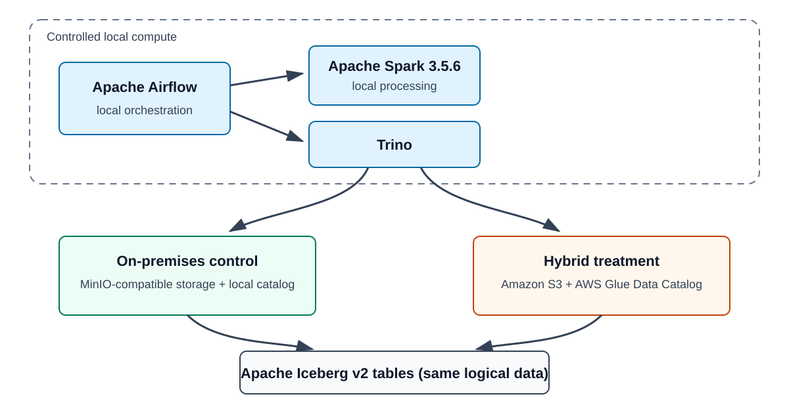

# UNIVERSITY OF SCIENCE AND TECHNOLOGY OF HANOI

## DEPARTMENT OF INFORMATION AND COMMUNICATION TECHNOLOGY

---

# MASTER THESIS

**Student:** `<TODO: Student name>`  
**Student ID:** `<TODO: Student ID>`  
**Major:** `<TODO: Major>`

## Trade-off Analysis and Optimization of a Hybrid Lakehouse Architecture Using Cloud Object Storage and Metadata Catalogs

**External Supervisor:** `<TODO: External supervisor>`  
**Internal Supervisor:** `<TODO: Internal supervisor>`

**Hanoi, `<TODO: Month 2026>`**

> **Draft status — 28 July 2026:** Phase 5 synthesis draft. It incorporates
> the accepted Phase 3 baseline, partition-pruning analysis, controlled
> file-layout experiment, and H3 executor-sizing experiment. Personal details,
> acknowledgements, and university formatting remain incomplete.

---

# SUPERVISOR CERTIFICATION

To whom it may concern,

I, `<TODO: Supervisor name>`, certify that the thesis/internship report of
Mr/Ms. `<TODO: Student name>` is qualified to be presented to the appropriate
USTH jury.

Hanoi, `<TODO: Date>`

**Supervisor's signature**

`<TODO: Signature>`

---

# TABLE OF CONTENTS

- [Acknowledgements](#acknowledgements)
- [List of Abbreviations](#list-of-abbreviations)
- [List of Tables](#list-of-tables)
- [List of Figures](#list-of-figures)
- [Abstract](#abstract)
- [I. Introduction](#i-introduction)
- [II. Objectives](#ii-objectives)
- [III. Materials and Methods](#iii-materials-and-methods)
- [IV. Results and Discussion](#iv-results-and-discussion)
- [V. Conclusion and Perspective](#v-conclusion-and-perspective)
- [References](#references)
- [Appendices](#appendices)

---

# ACKNOWLEDGEMENTS

`<TODO: Add acknowledgements for supervisors, the host laboratory or company,
USTH staff, colleagues, friends, and family. Do not retain this instruction in
the submitted version.>`

---

# LIST OF ABBREVIATIONS

| Abbreviation | Meaning |
| --- | --- |
| ACID | Atomicity, Consistency, Isolation, Durability |
| API | Application Programming Interface |
| AWS | Amazon Web Services |
| CPU | Central Processing Unit |
| DAG | Directed Acyclic Graph |
| ETL | Extract, Transform, Load |
| GiB | Gibibyte |
| H1–H3 | Research hypotheses 1 to 3 |
| IAM | Identity and Access Management |
| IQR | Interquartile Range |
| NYC TLC | New York City Taxi and Limousine Commission |
| RQ1–RQ2 | Research questions 1 and 2 |
| S3 | Amazon Simple Storage Service |
| SQL | Structured Query Language |
| USTH | University of Science and Technology of Hanoi |

---

# LIST OF TABLES

- [Table 1. Controlled and changed architecture components](#table-1)
- [Table 2. Comparative workload and execution protocols](#table-2)
- [Table 3. Accepted Phase 3 pipeline results](#table-3)
- [Table 4. Representative Trino query results](#table-4)
- [Table 5. Resource proxies and modeled cloud cost](#table-5)
- [Table 6. Qualitative resilience and operability trade-offs](#table-6)
- [Table 7. Partition-pruning results](#table-7)
- [Table 8. Controlled file-layout results](#table-8)
- [Table 9. Spark executor-sizing results](#table-9)
- [Table 10. Final hypothesis assessment](#table-10)

---

# LIST OF FIGURES

- [Figure 1. Experimental architecture and treatment boundary](#figure-1)

---

# ABSTRACT

This study evaluates the trade-offs created when the object storage and
metadata catalog of an Apache Iceberg lakehouse move from local infrastructure
to Amazon Web Services while Airflow, Spark, and Trino remain local. A
reproducible paired benchmark compared a MinIO-compatible store and local
catalog with Amazon S3 and the AWS Glue Data Catalog on NYC taxi workloads. Correctness gates, paired execution, separate cache
protocols, and retained metrics controlled validity. Across eight monthly partitions, hybrid
median pipeline runtime was 139.91% to 185.43% higher than the on-premises
baseline. Representative service-cold Trino medians were 5.5 to 13 times the local
medians. The aggregate marginal S3 request and transfer
estimate was USD 0.97383823, not a total-cost comparison. Partition-aware
queries reduced physical input by 69.44% to 83.67% and improved hybrid median
latency in 13 of 16 cases, although the relative penalty narrowed in only 10.
Controlled compaction improved service-cold local latency but did not improve
hybrid partition-query latency; fragmented hybrid layouts were often faster at
the tested scale. Increasing the Spark allocation from 4 to 8 or 12 cores did
not improve median pipeline runtime for either H3 workload. The hybrid boundary imposed performance and configuration costs while
providing managed AWS integration. Partition pruning is supported as a
practical mitigation, hybrid compaction benefit is not supported, and H3 shows
a local plateau without proving remote-I/O causation. All three hypotheses are
partially supported within the declared limitations.

**Keywords:** lakehouse; hybrid storage; Apache Iceberg; Amazon S3; AWS Glue
Data Catalog; performance benchmarking

---

# I. INTRODUCTION

## 1.1 Context

Modern analytical platforms must support large data volumes, reproducible data
engineering, interactive SQL analysis, and access from more than one compute
engine. Traditional data warehouses provide management and query features but
often bind users to proprietary storage and execution systems. Data lakes use
open files and comparatively inexpensive storage, but unmanaged collections of
files can lack transactional consistency, schema controls, and efficient query
planning. The lakehouse architectural pattern attempts to combine open,
directly accessible storage with database-management capabilities such as ACID
transactions, versioned metadata, governance, and query optimization
[@armbrust2021lakehouse].

Apache Iceberg implements a table layer over data files in formats such as
Parquet. An Iceberg snapshot identifies a consistent table state, while
manifests record data-file paths, partitions, and statistics. Query engines can
therefore plan scans from metadata and omit files that cannot match a
predicate. Iceberg also separates logical table definitions from physical
storage and supports schema and partition evolution [@iceberg2026spec]. These properties make
it possible for Spark to write data and Trino to query the same tables without
converting them into an engine-specific storage format.

Separating compute from storage also changes the performance model. Spark was
designed for distributed data processing and can retain intermediate data in
memory, but its performance still depends on data locality, network bandwidth,
task parallelism, and storage behavior [@zaharia2012rdd; @armbrust2015sparksql]. Trino is a distributed SQL engine
whose connector model allows a common query layer to read several storage
systems [@sethi2019presto]. When both engines run locally but table data moves to a remote
object store, each metadata and data access crosses a wider and less predictable
network path. Caching may hide part of that cost, while cold service restarts
can expose it.

This study uses the term **hybrid storage architecture** for the tested system:
Airflow, Spark, and Trino remain on local infrastructure, while storage and
catalog functions move to S3 and the AWS Glue Data Catalog. This wording is
deliberate. NIST defines a formal hybrid cloud as a composition of distinct
cloud infrastructures that remain separate but are connected to support data
or application portability [@mell2011nist]. The local Docker and MinIO environment in this
study has not been established as a NIST-conformant private cloud. Calling the
experiment a hybrid storage system is therefore more precise than claiming
that it demonstrates every property of the NIST hybrid-cloud deployment model.

## 1.2 Technical background

The local control architecture uses Apache Airflow to orchestrate monthly
pipelines, Spark 3.5.6 to stage and transform data, Apache Iceberg v2 as the
table format, and Trino to execute analytical SQL. Airflow represents workflows
as DAGs containing ordered tasks and can submit work to external processing
systems [@airflow2026architecture]. The pipeline stages yellow and green NYC taxi records into Silver
tables, records data-quality checks, and produces a monthly Gold revenue table.
The source data contain pickup and drop-off times and locations, trip distance,
fare components, payment information, and other trip attributes. NYC TLC notes
that the records are supplied by authorized technology providers and that it
does not guarantee their absolute accuracy [@nyctlc2026data].

The hybrid treatment preserves this application and compute path but replaces
the local object store and catalog with S3 and Glue. The Glue Data Catalog is a
managed metadata repository for table location, schema, and related structural
metadata [@gluecatalog2026]. S3 is a distributed object store that scales through parallel
requests, but observed performance depends on workload shape, request
parallelism, network capacity, and system configuration [@s3performance2026]. Consequently,
moving data to S3 cannot be assumed to improve or degrade performance by a
fixed amount. It must be measured under a controlled workload.

Iceberg and Trino expose two practical optimization opportunities. First,
partition predicates can reduce the files and bytes read for a query. Second,
compaction can merge small files into fewer, larger files, reducing metadata
and file-open overhead [@iceberg2026spec; @trino2026iceberg]. These mechanisms motivate the optimization
experiments, but they do not imply that either mechanism caused the baseline
performance difference. Causal interpretation requires a valid treatment
contrast.

## 1.3 Related systems and performance concerns

The lakehouse is part of a longer movement toward separating durable data from
elastic execution. Dremel demonstrated that a distributed execution tree and
columnar representation can support interactive analysis over data held in a
separate storage layer [@melnik2010dremel]. Snowflake subsequently described a
cloud warehouse that separates persistent storage, stateless compute clusters,
and cloud services so that compute can scale independently
[@dageville2016snowflake]. These systems differ from the open-table design used
here, but they establish the architectural motive: storage and compute need not
share a machine or lifecycle. The separation creates flexibility while making
network placement, metadata services, and cache state part of query
performance.

Open table formats address a different part of the problem. Delta Lake showed
how a transaction log over cloud objects can add atomicity, snapshots, and
metadata management while preserving Parquet data accessible to multiple
engines [@armbrust2020delta]. Iceberg uses immutable metadata trees, manifest
lists, manifests, and data files rather than Delta's transaction-log protocol,
but both systems move responsibilities normally associated with a database
storage manager into an open table layer. A comparative study of Delta Lake,
Hudi, and Iceberg found that transaction coordination, metadata placement,
metadata-query execution, and update strategy produce distinct trade-offs; it
also showed that file count can alter planning behavior at scale
[@jain2023lakehouse]. This literature justifies treating the catalog and table
metadata path as part of the experimental boundary instead of reducing the
study to bulk data-transfer speed.

Disaggregation also weakens simple intuitions about caching. Spark can reuse
in-memory working sets and Trino can cache metadata or file-system content, but
a warm process does not imply that all required state is local. The next query
may still require catalog calls, object metadata, or uncached byte ranges.
Conversely, a service restart does not flush operating-system pages, DNS
answers, remote caches, or storage-service state. Performance therefore depends
on a chain of layers rather than a binary cold/warm label. This study names its
controlled restart protocol *service-cold* and interprets warm results only
within that operational definition.

The small-file problem follows the same principle. More files can increase
manifest entries, split enumeration, scheduling work, file-open operations, and
object-store requests. Yet fewer files can also reduce parallel opportunities,
and compaction introduces write amplification and maintenance cost. The best
layout depends on table size, selectivity, engine planning, cache state, and the
latency-throughput characteristics of storage. Prior work motivates a controlled
layout experiment; it does not license an assumption that compaction must help.
That distinction is decisive because the accepted Phase 3 partitions already
contained one data file each. A deliberately fragmented Phase 4 treatment can
test layout sensitivity, but it cannot retroactively identify the cause of the
baseline penalty.

## 1.4 Research problem

Externalizing storage and metadata can provide access to managed AWS services,
regional failure domains, IAM-based controls, cloud monitoring, and storage
durability features. It simultaneously creates dependence on internet or
private-cloud connectivity and introduces remote-request latency, cloud
configuration, cost accounting, and shared-responsibility concerns. Generic
product documentation does not quantify those trade-offs for this particular
local-compute workload.

The central problem is therefore not whether cloud storage is universally
better than local storage. The problem is to measure what changes when the same
lakehouse pipeline and query workload crosses the local/cloud boundary, and to
test whether practical layout optimizations reduce the observed penalties.
Changing compute, orchestration, table format, business logic, and storage at
the same time would make attribution impossible. The experiment intentionally
changes only storage and catalog services in the baseline comparison.

## 1.5 Research questions and hypotheses

The study addresses two research questions:

**RQ1 — Hybrid storage trade-offs:** What performance, cost, reliability, and
operability trade-offs appear when lakehouse storage and catalog services move
from local infrastructure to AWS while compute remains local?

**RQ2 — Optimization impact:** Can practical file-layout and query-layout
optimizations reduce the observed hybrid-storage penalties?

Three hypotheses map to these questions:

- **H1:** Externalizing storage and catalog services improves access to managed
  durability and reduces responsibility for local storage infrastructure, but
  increases latency, network dependence, IAM/configuration complexity, and
  possibly runtime cost.
- **H2:** File-size control and partition-aware queries reduce query latency
  and request-related overhead in the hybrid architecture.
- **H3:** Increasing Spark parallelism improves ingestion only until remote
  object-store or network overhead becomes dominant.

H1 combines experimentally measured and qualitative dimensions. The benchmark
measures latency and resource proxies, but it does not directly prove AWS
durability or quantify operator effort. H2 is evaluated through both
partition-pruning and controlled file-layout evidence. H3 is evaluated through
the accepted executor-sizing comparison. Each hypothesis remains only
partially supported because at least one causal or operational component was
not measured directly.

---

# II. OBJECTIVES

The objective is to quantify the trade-offs of moving an Iceberg
lakehouse's object storage and metadata catalog from local infrastructure to AWS
while preserving local compute and application logic. The study establishes a
paired on-premises and S3/Glue baseline, then tests partition pruning,
controlled file layout, and Spark executor sizing against the observed hybrid
penalty. The strategy is to retain execution identity and engine evidence,
separate warm from service-cold protocols, enforce logical-result equivalence,
and distinguish measurements from qualitative service claims. The final
assessment reports bounded support for H1--H3 without generalizing beyond the
declared workload and environment, and translates those limits into practical
architecture, query-layout, and capacity recommendations.

---

# III. MATERIALS AND METHODS

## 3.1 System under study

<a id="figure-1"></a>

{width=95%}

**Figure 1. Experimental architecture and treatment boundary.** Compute,
pipeline code, table format, and workload are held constant. Object storage and
catalog services form the principal treatment.

<a id="table-1"></a>

**Table 1. Controlled and changed architecture components**

| Component | On-premises control | Hybrid treatment | Experimental role |
| --- | --- | --- | --- |
| Orchestration | Local Airflow | Local Airflow | Controlled |
| Processing | Local Spark 3.5.6 | Local Spark 3.5.6 | Controlled |
| SQL engine | Local Trino | Local Trino | Controlled |
| Table format | Apache Iceberg v2 | Apache Iceberg v2 | Controlled |
| Source workload | Eight NYC TLC monthly files | Same logical files with verified checksums | Controlled |
| Object storage | MinIO-compatible local storage | Amazon S3 in `us-east-1` | Changed |
| Catalog | Local Iceberg catalog | AWS Glue Data Catalog | Changed |
| Application logic | Staging, quality, and Gold jobs | Same jobs and schemas | Controlled |

AWS Glue ETL, S3 Tables, EMR, Databricks, Athena-only execution, and migration
of Spark or Airflow compute to AWS are outside the experimental baseline. This
boundary isolates remote storage and catalog effects as a combined
architecture-level treatment. It does not isolate S3 from Glue or from the
network path between local compute and AWS.

## 3.2 Dataset and processing pipeline

The benchmark uses yellow taxi data from 2011 and green taxi data from 2014.
Four months per dataset—January, April, July, and October—provide seasonal
coverage without expanding the study to every available partition. The eight
source objects were copied to isolated experiment locations and verified using
SHA-256 checksums. The accepted preparation manifest contained 16
architecture-specific objects with no local-to-remote checksum mismatch.

Each pipeline run executes three logical stages. The staging job normalizes the
source schema, derives deterministic `year` and `month` columns from pickup
timestamps, and writes the relevant Iceberg Silver partition. The quality job
calculates structural and domain checks and writes an audit result. The Gold
job produces monthly trip, validity, revenue, amount, distance, and duration
aggregates. Partition writes use retry-safe overwrite semantics so repeated
benchmark executions do not append duplicate logical data.

An initial official comparison attempt failed on green July 2014 because the
quality schema allowed signed fares and totals but rejected negative tips and
tolls. Inspection showed 17 negative-tip rows and five negative-toll rows that
were internally coherent refund or void records rather than staging
corruption. The rule was internally inconsistent, and the earlier January-only
preflight had not exercised July. The failed comparison identifier and all
partial evidence were preserved and permanently invalidated. The corrected
protocol treated negative tips and tolls as soft warnings while retaining hard
checks for structural, partition, derivation, and schema failures. A fresh
namespace, warehouse prefix, commit, preparation manifest, and comparison
identifier were used for the accepted recovery run.

This failure is methodologically important. A benchmark is invalid if its
quality gate rejects valid source-domain behavior or if a narrow preflight
misses behavior present in the official workload. Preserving the failed
evidence prevents selective deletion, while replacing rather than repairing
the identifier prevents a partial run from being mistaken for an independent
complete comparison.

## 3.3 Benchmark workload

<a id="table-2"></a>

**Table 2. Comparative workload and execution protocols**

| Workload | Scope | Repetitions | Primary evidence |
| --- | --- | ---: | --- |
| Pipeline pair | Each of eight monthly partitions, both architectures | 3 paired trials | End-to-end duration and Spark task metrics |
| Correctness queries | Row count, latest quality status, Gold aggregate | 1 per partition and architecture | Logical equivalence |
| Warm performance queries | Financial and pickup-location queries for each partition; one broad scan per dataset | 1 unrecorded warm-up + 5 recorded | Trino latency and physical input |
| Service-cold queries | Same performance targets after controlled Trino restart/readiness checks | 3 recorded | Cold-service latency and physical input |
| Controlled file layout | On-premises and hybrid, deliberately fragmented and compact layouts | Warm and service-cold paired blocks | Layout effect, architecture interaction, correctness |
| Spark executor sizing | Hybrid yellow 2011-01 and green 2014-01 at 4, 8, and 12 cores | 3 complete repetitions per profile | Pipeline runtime, stability, applied Spark configuration |

The financial query calculates total amount and average distance and duration.
The pickup-location query groups trips by pickup location. The broad financial
scan omits monthly predicates and aggregates the four measured partitions for
one dataset. Correctness results were deterministically sorted before
cross-architecture comparison.

Architectures were alternated within paired trials to reduce persistent order
bias. Each execution carried a unique run identity, sequence position,
architecture, workload, protocol, attempt number, configuration hash, and
commit SHA. Any incomplete or contaminated pair would invalidate the pair
rather than retain only its successful member.

For service-cold measurements, the Trino coordinator and both workers were
restarted before a trial, then polled until all nodes and a bounded readiness
query succeeded. A restart does not guarantee removal of every operating
system, network, S3, or metadata cache. The protocol is therefore named
*service-cold*, not *fully cold*. Warm and service-cold samples are analyzed
separately.

## 3.4 Measurements and evidence

The benchmark stored normalized metrics in
`lakehouse.benchmark.run_metrics` and retained per-run JSON artifacts. Pipeline
metrics include wall-clock duration and identifiers linking Airflow tasks to
Spark History applications. Trino metrics include query ID, status, duration,
returned rows, and physical input where available. Iceberg layout metrics
record data-file count and size for measured partitions.

Docker CPU and memory were sampled at five-second intervals around evidence
blocks. CPU-seconds and GiB-hours are reported as resource proxies; configured
CPU-hours and configured memory GiB-hours represent provisioned capacity over
elapsed time. These figures are not cloud billing values and were not converted
to local currency or USD.

AWS evidence included object listings, CloudWatch metrics, and a dated pricing
response. The reported cloud figure models aggregate marginal S3 request and
internet-transfer cost for the captured evidence blocks. CloudWatch storage
metrics are daily bucket/storage-class snapshots rather than precise
per-query, per-prefix measurements. Cost Explorer reconciliation was deferred.
The study therefore does not report total cost of ownership, per-query S3 cost,
or a claim that either architecture is cheaper.

Reliability and operability are evaluated using an evidence-backed qualitative
matrix. No failure-injection experiment was performed. AWS documentation and
configuration demonstrate the availability of managed durability,
versioning/lifecycle, IAM, encryption, CloudWatch, and audit mechanisms, but
the benchmark does not experimentally estimate durability, recovery time, or
operator labor.

## 3.5 Statistical analysis and acceptance

The main summaries report the median, linear-interpolation IQR, and p95.
Paired percentage deltas compare architecture members of the same workload
pair. Ninety-five-percent paired intervals use 10,000 deterministic bootstrap
resamples with seed `20260713`. The file-layout analysis also uses
deterministic 10,000-resample median intervals for layout effects and
architecture-by-layout interactions. H3 reports the three observed pipeline
runtimes and their median for each workload/profile cell. Sample sizes are
small—three pipeline trials, three service-cold queries, five warm queries, and
three H3 profile repetitions—so the intervals and medians describe the
observed sample and no p-value or population-level significance claim is made.

The experimental design follows established warnings from systems-performance
research. Seemingly irrelevant setup differences can bias a comparison, so the
architecture order rotates within pairs and failed pairs are not selectively
retained [@mytkowicz2009wrong]. Runtime variability requires repeated
measurement and an explicit warm-up policy rather than a single "representative"
run [@georges2007rigorous]. Scientific benchmarking guidance also requires the
system, workload, metric, aggregation, and uncertainty procedure to be stated
well enough for a reader to reproduce the interpretation
[@hoefler2015benchmarking].

Effect estimates are reported with their denominators and intervals because a
large percentage over a near-zero baseline can be operationally small in
absolute time. Confidence intervals quantify the observed sample's uncertainty;
they do not convert this convenience sample into a random sample of all
lakehouse deployments [@kalibera2020effect]. The thesis uses medians because
runtime distributions can be skewed, but it does not average normalized ratios
across unrelated workloads. That restriction avoids a known benchmark-reporting
error in which arithmetic aggregation of normalized results changes the implied
ranking [@fleming1986statistics]. These choices improve internal consistency but
do not overcome the small number of repetitions.

Acceptance is separated from execution. Automated gates establish that a run is
complete, correctly identified, internally consistent, and logically equivalent
across architectures; they do not decide whether the remaining limitations are
acceptable for the thesis claim. The failed July quality-gate attempt was kept
as invalid evidence, and each later official report required explicit acceptance
before becoming canonical. This procedure reduces the risk that a convenient
partial result silently replaces the declared comparison. It also leaves an
auditable distinction between raw observations, derived statistics, qualitative
service documentation, and the final hypothesis judgment. The evidence map in
the appendix links those layers back to frozen comparison definitions, accepted
reports, query text, and the metrics schema. Reproduction still depends on the
declared runtime topology and credentials; repository provenance alone cannot
recreate an external service or historical network path.

The accepted comparison passed automated identity, completeness, execution,
artifact/database consistency, and result-equivalence gates. It completed 166
of 166 scheduled comparison attempts with no failed or retried attempt. All
correctness results matched between architectures after deterministic sorting.
The canonical evidence identity is:

```text
comparison_id = phase3_baseline_20260727T035807Z_fde426a
commit_sha    = fde426a8031a8ea101d470b54a8f0de5d4207336
status        = accepted on 2026-07-27
```

## 3.6 Optimization experiments

### 3.6.1 Partition pruning

The first RQ2 analysis reuses accepted Phase 3 query measurements. For each
dataset and protocol, the broad scan over four monthly partitions is compared
with the corresponding partition-filtered financial aggregation. Physical
input reduction is calculated from Trino bytes, and latency reduction is
calculated from medians. The broad-scan median is reused as the reference for
four monthly cases, so the 32 comparisons are cases, not 32 independent broad
samples.

This analysis tests whether monthly predicates reduce absolute work and
latency. It does not return the same logical result as the broad query, does
not directly count S3 requests, and cannot by itself establish that partition
pruning removes the relative hybrid penalty.

### 3.6.2 Controlled file layout

The file-layout experiment uses a two-by-two design: on-premises versus hybrid
architecture, crossed with deliberately fragmented versus compact layout. Each
fragmented partition contains 16 non-empty data files; the compact treatment
derives one logically equivalent file. Warm and service-cold Trino protocols
remain separate. Correctness, file-count, identity, and completeness gates
must pass before layout effects are interpreted.

The primary layout effect is the percentage by which the fragmented treatment
differs from the compact treatment. Positive values mean fragmentation was
slower; negative values mean fragmentation was faster. The
architecture-by-layout interaction tests whether the fragmentation effect is
larger in the hybrid architecture. Physical-input bytes are engine-level scan
evidence, not S3 request counts. The official run contains 486 paired steps and
1,944 cell executions with zero failures.

### 3.6.3 Spark executor sizing

The H3 experiment keeps the hybrid input objects, application code, 6 GiB
executor memory, four cores per executor, worker hardware, table schemas, S3
configuration, and Glue catalog constant. It varies `spark.cores.max` across
4, 8, and 12 cores, corresponding to one, two, and three four-core executors.
Yellow January 2011 and green January 2014 each run three times per profile,
giving 18 pipeline executions in six three-way comparison blocks. Profile
order rotates across blocks to limit persistent order bias.

This experiment can identify a local performance plateau under the declared
cluster and workload. Because network capacity, S3 behavior, and catalog
traffic are not independently manipulated, it cannot establish which remote
component caused a plateau.

---

# IV. RESULTS AND DISCUSSION

The results begin with the accepted architecture-level baseline and then
evaluate partition pruning, controlled file layout, and Spark executor sizing.
This ordering separates the observed hybrid penalty from later mitigation
experiments and prevents an optimization result from being used
retrospectively as the cause of the baseline difference.

## 4.1 Pipeline performance

<a id="table-3"></a>

**Table 3. Accepted Phase 3 pipeline results**

| Partition | On-prem median (s) | Hybrid median (s) | Paired delta | 95% bootstrap interval |
| --- | ---: | ---: | ---: | --- |
| Yellow 2011-01 | 64.564 | 165.426 | +156.22% | +155.85% to +178.52% |
| Yellow 2011-04 | 68.303 | 168.910 | +147.30% | +131.51% to +154.38% |
| Yellow 2011-07 | 67.769 | 167.171 | +146.68% | +144.62% to +147.76% |
| Yellow 2011-10 | 70.303 | 168.663 | +139.91% | +138.03% to +162.96% |
| Green 2014-01 | 35.732 | 98.818 | +175.34% | +171.19% to +206.38% |
| Green 2014-04 | 37.116 | 105.330 | +185.43% | +183.78% to +187.40% |
| Green 2014-07 | 36.525 | 103.993 | +184.72% | +177.49% to +188.84% |
| Green 2014-10 | 38.124 | 104.990 | +183.66% | +174.00% to +186.32% |

Every measured hybrid pipeline median exceeded its paired on-premises median.
The hybrid increase ranged from 139.91% to 185.43%, equivalent to approximately
2.40 to 2.85 times the on-premises median. Yellow partitions took longer in
both architectures, consistent with their larger workload, but green
partitions had the larger relative hybrid penalties.

Because Spark compute, application code, schemas, workload, and table format
were controlled, the result supports the conclusion that the combined remote
storage/catalog treatment imposed substantial overhead in the tested system.
It does not identify a single cause. S3 data transfer, Glue metadata calls,
authentication, the internet path, object-store request latency, and
interactions with Spark scheduling are all inside the treatment boundary.

The result supports the performance component of H1. It does not show that
hybrid processing is always slower. The experiment uses local compute in one
location, S3 in `us-east-1`, a fixed data scale, and fixed service topology.
Moving compute closer to the data, using private connectivity, changing file
sizes, or increasing concurrency could change the outcome.

The direction of the result is consistent with systems literature describing
cloud objects as a high-latency substrate that needs a table protocol and
careful metadata management [@armbrust2020delta; @jain2023lakehouse]. The
magnitude is not transferable from those studies: this experiment places Spark
outside AWS, includes three application stages, and measures end-to-end pipeline
completion rather than an isolated object operation. Published systems results
therefore explain why the treatment is plausible, not why a particular monthly
partition was 2.40 or 2.85 times slower.

Two alternative explanations deserve equal attention. First, fixed setup and
commit costs occupy a larger fraction of the smaller green workload, which can
produce a greater relative penalty even when fewer bytes move. Second, the
combined treatment includes Glue calls, credential resolution, TLS connections,
and local-to-region networking. A stable monthly pattern cannot separate these
components. The lower sampled hybrid CPU-seconds later reported is compatible
with waiting, but it is not a direct measure of network stalls. Component-level
tracing or a factorial design that changes storage, catalog, and compute
placement independently would be required for causal decomposition.

Practically, the pipeline result means that a migration preserving local
compute should be capacity-planned from measured end-to-end runs, not from S3
throughput claims. Scheduling windows, retry budgets, and Airflow timeouts must
accommodate the observed elapsed time. It also means that adding Spark cores is
not the first justified response: the baseline does not identify CPU shortage,
and the later H3 experiment directly tests that assumption.

## 4.2 Trino query performance

<a id="table-4"></a>

**Table 4. Representative Trino query results**

| Protocol and query | Partition | On-prem median (s) | Hybrid median (s) | Paired delta |
| --- | --- | ---: | ---: | ---: |
| Service-cold financial | Green 2014-01 | 1.154 | 6.738 | +481.77% |
| Service-cold financial | Yellow 2011-10 | 1.363 | 13.313 | +876.64% |
| Service-cold pickup aggregation | Green 2014-01 | 1.195 | 6.628 | +454.67% |
| Service-cold pickup aggregation | Yellow 2011-10 | 1.500 | 10.167 | +584.00% |
| Service-cold broad scan | Green 2014 | 1.257 | 7.859 | +525.25% |
| Service-cold broad scan | Yellow 2011 | 1.847 | 23.938 | +1154.32% |
| Warm broad scan | Green 2014 | 0.070 | 2.806 | +3810.34% |
| Warm broad scan | Yellow 2011 | 0.302 | 14.946 | +4748.54% |

The query penalty was more pronounced than the pipeline penalty. Under the
service-cold protocol, representative hybrid medians were approximately 5.5
to 13 times the local medians. Warm local queries became extremely fast,
whereas warm hybrid queries retained seconds of latency. This produced very
large percentage deltas, including 3810.34% and 4748.54% for the broad scans.

Percentage deltas must be interpreted with the absolute medians. A difference
between 0.070 and 2.806 seconds is operationally different from a difference
between 70 and 280 seconds even if both are large ratios. The warm results also
reflect different cache effectiveness across the two storage paths.
Long-lived Trino processes can retain metadata and data-related state, but a
remote object access still crosses the local/AWS boundary. The evidence shows
that the configured local path benefited much more from warming; it does not
identify which individual cache layer produced that advantage.

Correctness queries also ran more slowly against the hybrid architecture, but
they executed only once per partition. Those observations verify function and
result equivalence; they are not treated as performance samples or used for
statistical inference.

The result can be read against two distinct bodies of prior work. Distributed
SQL systems such as Dremel and Presto obtain interactive performance through
parallel scans, columnar data, pipelined operators, and distributed aggregation
[@melnik2010dremel; @sethi2019presto]. Those techniques remain present here,
but they cannot remove a fixed remote boundary from a small query. At this
scale, scheduling, metadata, connection, and object-open costs can dominate the
few megabytes scanned. The experiment therefore illustrates a latency regime in
which scale-out query architecture and storage placement interact.

Cache behavior is an important alternative explanation. The local warm broad
medians of 0.070 and 0.302 seconds make percentage ratios highly sensitive to
small absolute changes. The hybrid warm results show that restarting nothing
did not reduce the remote path to local-memory speed, but the collected metrics
do not identify whether Iceberg metadata, Parquet ranges, connector state, or
operating-system pages were reused. Likewise, service-cold medians combine
restart overhead controls with residual caches outside the Trino processes.
Calling one protocol "uncached" would overstate what the procedure guarantees.

For interactive use, absolute latency is the more actionable quantity. A
hybrid broad scan of 7.859 or 23.938 seconds changes dashboard and exploratory
query behavior even when a batch pipeline can tolerate minutes. A production
decision should separate interactive service-level objectives from batch
completion windows, test concurrent users, and measure p95 under sustained
load. This thesis reports single-query samples and does not infer concurrency
capacity.

## 4.3 Resource and cost evidence

<a id="table-5"></a>

**Table 5. Resource proxies and modeled cloud cost**

| Measurement | On-premises | Hybrid | Interpretation |
| --- | ---: | ---: | --- |
| Sampled CPU-seconds | 3860.778 | 3365.466 | Host/container activity proxy |
| Sampled memory GiB-hours | 3.582 | 6.718 | Integrated memory-use proxy |
| Configured CPU-hours | 7.941 | 17.110 | Capacity over elapsed time |
| Configured memory GiB-hours | 23.824 | 51.329 | Capacity over elapsed time |
| Modeled marginal S3 request and transfer cost | Not applicable | USD 0.97383823 | Aggregate AWS evidence blocks only |

The hybrid evidence window consumed more elapsed configured capacity and a
higher integrated memory proxy, while sampled CPU-seconds were lower. This is
consistent with more time spent waiting on remote operations, but CPU samples
alone cannot prove that mechanism. Container sampling also does not provide
the precision of engine-level resource attribution.

The AWS estimate shows that direct S3 request and transfer charges were small
for this experimental scale. It does not demonstrate that hybrid storage was
cheaper. The comparison lacks amortized local hardware, electricity, operator
time, internet service, full AWS storage duration, Glue request charges where
applicable, and reconciled billing totals. A valid total-cost conclusion would
require a common accounting boundary and longer observation window.

This limitation is material because S3 prices storage, request classes,
retrieval, and data transfer under different rules [@s3pricing2026]. The model
uses the dated rates and captured aggregate evidence available to the
experiment; it is not an invoice and should not be refreshed silently with
later prices. Even a correct marginal estimate answers only what the captured
S3 operations would cost. It cannot compare that amount with a local system
whose capital, energy, maintenance, and labor costs were not allocated.

The apparent combination of lower CPU-seconds and longer elapsed capacity also
has more than one explanation. Remote waiting is plausible, but differences in
sampling alignment, process activity, garbage collection, and task scheduling
can affect integrated proxies. Engine event logs or profilers would be needed
to divide time into CPU, network, catalog, object-read, and commit components.
The proxies are retained because they constrain speculation: they do not show a
hybrid CPU saturation that would justify more executors.

## 4.4 Reliability, operability, security, and portability

<a id="table-6"></a>

**Table 6. Qualitative resilience and operability trade-offs**

| Dimension | On-premises control | Hybrid treatment |
| --- | --- | --- |
| Failure domain | One local site and local services | Local compute plus regional AWS services and connecting network |
| Redundancy | Designed and operated locally | S3 and Glue service infrastructure managed by AWS |
| Recovery ownership | Local operator owns every layer | Shared responsibility between local operator and AWS |
| Network dependency | Primarily local network | Continuous reachability to AWS |
| Identity and secrets | Local service credentials | Local credentials plus IAM policy and provider chain |
| Monitoring | Container, Airflow, Spark, and Trino telemetry | Local telemetry plus AWS metrics and audit facilities |
| Configuration | Local endpoints and catalog | Region, buckets, Glue, IAM, S3 client, and network configuration |
| Portability | S3-compatible storage and Iceberg | Same table format, but Glue and IAM introduce provider-specific configuration |

The hybrid architecture moves responsibility for storage/catalog service
infrastructure to AWS and provides access to managed regional services. It
does not eliminate operations. The local operator still owns Airflow, Spark,
Trino, credentials, networking, application correctness, and the integration
between local and AWS systems. The number of failure domains and configuration
boundaries increases.

The use of Iceberg, Parquet, Spark, and Trino preserved most data and query
logic across architectures. This is positive portability evidence: the
pipeline did not require a second implementation. Portability is not complete,
however. Glue catalog configuration, IAM, S3 endpoints, bucket locations, and
AWS-specific evidence collection remain provider-specific.

Security similarly changes rather than simply improves. IAM, service-side
encryption options, and AWS audit facilities can strengthen control, but
incorrect IAM policy or exposed long-lived credentials can add risk. The
benchmark verified configured access and successful operation; it was not a
penetration test or formal security assessment.

AWS formalizes the division as security "of" the cloud versus security "in"
the cloud: AWS operates the service infrastructure, while the customer remains
responsible for data, identity, permissions, and selected configurations
[@aws2026shared]. That model supports the responsibility labels in Table 6 but
is not measurement evidence that the hybrid deployment was safer. A defensible
security evaluation would define controls, test their implementation, and
retain assessment evidence. NIST SP 800-53 provides a broad control catalog for
such work, far beyond the access-success checks performed here
[@nist2020controls].

Reliability has the same evidence boundary. Regional S3 and Glue services alter
the failure domain, but this study did not interrupt the internet path, revoke
credentials, simulate a regional impairment, restore a table snapshot, or
measure recovery time. The hybrid architecture may remove local disk and
catalog operations while adding dependency on provider availability and wide
area connectivity. The correct result is a responsibility and dependency map,
not an availability percentage.

H1 is therefore supported for measured latency and network/configuration
dependence, and qualitatively consistent with a transfer of storage-management
responsibility. Its durability and operator-effort components remain
unmeasured. They should not be described as experimentally proven benefits.

## 4.5 Partition pruning

<a id="table-7"></a>

**Table 7. Partition-pruning results**

| Result | Observed value |
| --- | ---: |
| Physical-input reduction | 69.44%–83.67% |
| Cases with lower median latency | 28/32 |
| Hybrid cases with lower median latency | 13/16 |
| Cases where relative hybrid penalty narrowed | 10/16 |

Monthly filters reduced physical input in every comparison. For yellow data,
the broad query read 241,153,632 bytes, whereas filtered queries read
55,874,946 to 64,481,506 bytes. For green data, the broad query read
16,850,101 bytes, whereas filtered queries read 2,751,421 to 5,149,561 bytes.
Identical byte counts across architectures are consistent with matched table
content and observed file layout, but they do not prove identical
object-store internals or request patterns.

The absolute latency effect was usually favorable. In service-cold hybrid
yellow cases, monthly filters reduced median latency by 44.39% to 48.58%.
Hybrid green service-cold reductions were smaller, from 3.45% to 14.27%. Warm
hybrid green results were inconsistent: January improved by 48.07%, while
April, July, and October were slower after filtering. With five warm samples
per target, these adverse cases may reflect metadata, cache, fixed-request, or
measurement effects that the experiment cannot isolate.

The relative architecture penalty narrowed in only 10 of 16 cases. A filtered
query can reduce both absolute hybrid latency and bytes while still leaving a
large—or even larger percentage—gap against a very fast local baseline.
Partition pruning is therefore supported as an absolute I/O mitigation. It is
not a complete explanation or removal of hybrid overhead.

This result supports the query-layout component of H2 for physical-input
reduction and usually for absolute latency. The evidence does not support the
request-overhead component because S3 API requests were not isolated per
query. The separate controlled experiment evaluates the file-layout component.

The physical-input result is consistent with Iceberg's design: partition
transforms and manifest metadata allow an engine to select relevant files
without exposing the physical partitioning as a fragile directory convention
[@iceberg2026spec]. Trino's connector then plans the selected files through the
table metadata path [@trino2026iceberg]. The identical byte reductions across
architectures confirm that the logical predicate reached the same physical
data selection; they do not confirm an equal number of catalog or S3 calls.

The adverse warm green cases prevent a simplistic claim that reading fewer
bytes always lowers elapsed time. Their filtered scans saved between 69.44% and
83.67% of physical input, yet three medians increased. At small scale, fixed
planning and request costs can outweigh saved transfer, and five repetitions
cannot distinguish a persistent effect from runtime variability. The
service-cold green medians all improved, which makes a cache or fixed-cost
interaction plausible, but the protocol does not isolate it.

The practical implication is still strong but narrower: partition predicates
should be preserved because they deterministically reduce scanned bytes and
usually reduced hybrid latency here. Teams should verify predicate application
from engine metrics rather than infer it from SQL text, and should evaluate
absolute service objectives rather than only the hybrid/local ratio. Pruning is
a workload design rule, not a cure for every cost introduced by remote storage.

## 4.6 Controlled file layout

<a id="table-8"></a>

**Table 8. Controlled file-layout results**

Positive fragmentation effects mean the fragmented layout was slower than the
compact layout; negative effects mean it was faster.

| Protocol and query | On-premises fragmentation effect | Hybrid fragmentation effect | Interpretation |
| --- | ---: | ---: | --- |
| Service-cold financial aggregation | +53.05% | -9.70% | Compaction helped on-premises but hurt hybrid latency |
| Service-cold pickup aggregation | +55.11% | -6.56% | Compaction helped on-premises but hurt hybrid latency |
| Service-cold dataset scan | +36.33% | -3.13% | Local benefit; hybrid interval included no clear effect |
| Warm financial aggregation | -2.47% | -19.51% | No local compaction benefit; compact hybrid was slower |
| Warm pickup aggregation | -2.93% | -8.21% | Fragmented median was faster in both architectures |
| Warm dataset scan | +43.72% | +11.90% | Compaction benefit was smaller and uncertain in hybrid |

The deliberately fragmented layout increased the number of files from one to
16 while preserving logical results. Compaction substantially improved
service-cold on-premises partition-query latency, but the same treatment did
not improve the hybrid partition queries. Instead, fragmented hybrid medians
were 9.70% and 6.56% faster for the two service-cold partition queries and
19.51% and 8.21% faster for their warm counterparts. The dataset-wide hybrid
effects were smaller and their intervals included no clear effect.

Iceberg and Trino documentation present compaction as a response to small-file
metadata and file-open overhead [@iceberg2026spec; @trino2026iceberg]. The on-premises service-cold result is
consistent with that mechanism, but the hybrid result shows that fewer files
do not guarantee lower end-to-end latency when other fixed, cache, catalog, or
network effects remain in the path.

The result rejects a simple assumption that fewer files necessarily improve
hybrid query latency at this scale. It also prevents small files from being
used as a retrospective explanation for Phase 3, whose measured partitions
already had one file each. The runner did not isolate S3 request windows, and
the validation-only preparation did not measure compaction runtime, write
resources, or write cost. The file-layout component of H2 is therefore
unsupported in the tested hybrid treatment; no request-count or write-cost
claim is permitted.

This outcome is not a contradiction of the small-file literature. Prior
lakehouse work reports that large file counts can increase metadata and
planning work, especially at much larger table scales [@armbrust2020delta;
@jain2023lakehouse]. The treatment here contains only 16 files per fragmented
partition, and the hybrid query may exploit parallel object reads differently
from the local path. In addition, the compact and fragmented layouts preserve
logical rows but not necessarily identical scheduling opportunities. The
experiment answers whether this exact 16-to-1 treatment improved end-to-end
latency; it does not locate a universal optimal file size.

The architecture interaction is more informative than either layout effect in
isolation. Service-cold local partition queries benefited by more than 50% from
compaction, while hybrid medians moved in the opposite direction. A tuning rule
copied from the local control would therefore have degraded the measured hybrid
workload. This is direct evidence for benchmarking optimizations in the target
architecture instead of assuming that an engine-level best practice transfers
unchanged across storage boundaries.

A complete compaction decision would include preparation runtime, temporary
storage, rewritten bytes, snapshot retention, request charges, and the period
over which read savings repay write cost. None was measured in the official
validation-only preparation. The appropriate operational action is to retain
the current layout for this workload, monitor organically emerging file counts,
and reopen compaction only with both read-side and write-side evidence.

## 4.7 Spark executor sizing

<a id="table-9"></a>

**Table 9. Spark executor-sizing results**

| Workload | 4-core median (s) | 8-core median (s) | 12-core median (s) | Result |
| --- | ---: | ---: | ---: | --- |
| Green 2014-01 | 94.118 | 100.007 | 99.330 | 8 and 12 cores were 6.26% and 5.54% slower than 4 cores |
| Yellow 2011-01 | 159.632 | 162.503 | 162.819 | 8 and 12 cores were 1.80% and 2.00% slower than 4 cores |

All 18 pipeline executions completed successfully, and retained Spark History
properties verified that each profile applied its declared core allocation.
Increasing the allocation from 4 to 8 or 12 cores did not improve median
pipeline runtime for either workload. Task-level timings showed no uniform scaling benefit across the pipeline, and
the retained configuration evidence rules out a failure to apply the
requested core limits.

AWS guidance describes parallel requests as an S3 performance mechanism [@s3performance2026],
but a Spark core limit is not an independent manipulation of S3 request
concurrency. The pipeline also includes catalog, transformation, validation,
and Iceberg commit work, so the absence of core scaling does not contradict
that service-level guidance.

This result supports the diminishing-return component of H3 within the tested
configuration. It does not show an initial speedup followed by saturation, and
it does not isolate object storage or network overhead as the cause. H3 is
therefore partially supported, not fully confirmed.

Spark's tuning guidance emphasizes that performance depends on serialization,
memory, task sizing, data locality, and resource configuration rather than core
count alone [@spark356tuning]. The H3 design holds memory and worker hardware
constant, but increasing `spark.cores.max` changes how many tasks may compete
for those fixed resources. More available executor slots can add coordination
or I/O concurrency without shortening a stage whose critical path is elsewhere.
The result is therefore compatible with several bottlenecks, including fixed
job setup, limited parallel tasks, local contention, catalog operations, object
reads, or commit serialization.

The green differences are larger than the yellow differences, yet only three
runs populate each cell. A formal ranking of the 8- and 12-core profiles would
be false precision. The robust observation is simpler: neither larger profile
beat the 4-core median for either declared workload, and every applied
configuration was verified. That is enough to reject "allocate more local
cores" as a supported optimization at this scale.

Operationally, the 4-core profile is the evidence-based default for these two
monthly partitions because it uses fewer resources without a measured runtime
penalty. It is not a universal capacity recommendation. Larger partitions,
more concurrent pipelines, different executor memory, co-located cloud compute,
or an independently faster network could shift the optimum. A causal H3
follow-up would vary network or object-store conditions independently while
retaining the core profiles.

## 4.8 Final hypothesis assessment

<a id="table-10"></a>

**Table 10. Final hypothesis assessment**

| Hypothesis | Final status | Evidence boundary |
| --- | --- | --- |
| H1: hybrid-storage trade-off | Partially supported | Large measured pipeline/query penalties and greater network/configuration dependence; qualitative transfer of service responsibility; durability and operator effort were not experimentally measured |
| H2: file- and query-layout optimization | Partially supported | Partition pruning reduced input and usually absolute latency; hybrid compaction was unsupported/adverse at tested scale; S3 request counts were not isolated |
| H3: Spark parallelism limit | Partially supported | 8 and 12 cores did not beat 4-core medians; the proposed remote-I/O cause was not isolated |

No hypothesis is treated as universally proven. H1 has the strongest direct
architecture-level performance evidence. H2 contains one supported mitigation
and one adverse result. H3 establishes a local sizing plateau but not its
mechanism. These distinctions are central to the final answer: the research
identifies bounded trade-offs and mitigations rather than a universally
optimal architecture.

Taken together, the results reject three common shortcuts. The large baseline
penalty does not prove S3 alone was slow; the pruning benefit does not prove
that bytes dominate every query; and the absence of core scaling does not prove
a remote-I/O bottleneck. The experiments instead establish treatment-level
facts and eliminate unsupported remedies. This negative evidence is useful:
it narrows the next design decision to compute placement, connectivity, and
component-level tracing rather than indiscriminate compaction or executor
expansion. It also prevents managed-service features from being counted as
measured reliability outcomes.

The sequence of evidence also matters. Phase 3 established the architecture
contrast before Phase 4 introduced optimizations. Partition pruning was analyzed
as a workload contrast, file layout as a controlled architecture-by-layout
treatment, and executor sizing as a hybrid-only resource experiment. Keeping
those estimands separate prevents a later favorable case from diluting the
baseline or an adverse optimization from being misreported as evidence against
the architecture comparison. The final hypothesis statuses summarize that
structure: partial support means a defined component survived its test while a
causal, operational, or optimization component did not.

## 4.9 Threats to validity

Several limitations constrain generalization:

1. **Single environment:** one local cluster, one AWS account and region, and
   one network path were studied.
2. **Small sample sizes:** three pipeline, three service-cold, and five warm
   repetitions support descriptive comparison but not broad statistical
   inference.
3. **Combined treatment:** S3, Glue, authentication, and network distance
   changed together. Their individual causal contributions are not isolated.
4. **Cache definition:** service restart controls Trino process state but not
   every operating-system, DNS, network, AWS, or storage cache.
5. **Dataset scope:** eight monthly NYC taxi partitions represent batch
   analytical workloads, not streaming, high-concurrency, or multi-terabyte
   production workloads.
6. **Cost scope:** the AWS estimate is marginal and aggregate; local total cost
   and reconciled cloud billing are absent.
7. **Reliability scope:** no outage, retry, recovery-time, or durability
   experiment was executed.
8. **Workload reuse in pruning:** each broad-scan median is reused for four
   monthly comparisons, so those cases are not independent.
9. **Induced file layout:** the 16-to-1 treatment is deliberately constructed
   at the tested scale; it does not represent every production small-file
   distribution, and write-side preparation was not timed.
10. **Executor-sizing scope:** H3 uses two monthly partitions, three
    repetitions, and one 12-core cluster. It does not manipulate network or S3
    capacity independently.
11. **Benchmark instrumentation:** Docker sampling and Trino physical input are
    useful proxies, not direct measurements of every storage request or engine
    stall.

These limitations do not invalidate the observed comparison. They restrict
the claim to the tested architecture, workload, configuration, and evidence
window.

---

# V. CONCLUSION AND PERSPECTIVE

This study established a reproducible comparison between an on-premises
Iceberg lakehouse and a hybrid storage architecture in which local Airflow,
Spark, and Trino access Amazon S3 and the AWS Glue Data Catalog. The accepted
baseline controlled application code, table format, compute placement, logical
data, schemas, workload, and execution identity. The later optimization
experiments preserved explicit treatment boundaries and passed correctness,
completeness, configuration, and evidence gates.

The answer to RQ1 is a bounded trade-off, not a binary preference for local or
cloud storage. In the tested environment, hybrid pipeline medians were 139.91%
to 185.43% higher than on-premises medians, and Trino penalties were larger.
Hybrid storage added network, IAM, region, credential, and
shared-responsibility boundaries. In exchange, it integrated the lakehouse
with managed storage and catalog services, AWS monitoring and security
mechanisms, and a regional service failure domain while preserving Iceberg,
Parquet, Spark, Trino, and most application logic. The measured marginal S3
request and transfer estimate was USD 0.97383823, but the evidence cannot rank
total cost. H1 is partially supported because latency and configuration
dependence were measured, while durability and operator-effort benefits remain
qualitative.

RQ2 produced mixed optimization evidence. Partition-aware queries reduced
physical input by 69.44% to 83.67% and improved hybrid median latency in 13 of
16 cases, so predicate design is a practical absolute-I/O mitigation.
Controlled compaction did not improve hybrid partition-query latency at the
tested scale; deliberately fragmented hybrid layouts were often faster, even
though compaction improved service-cold local queries. File size is therefore
not a universal tuning direction, and small files cannot explain the accepted
single-file Phase 3 penalty. H2 is partially supported through query layout,
unsupported for the tested hybrid compaction treatment, and unresolved for
request-count reduction.

The executor-sizing experiment found no median pipeline improvement when the
allocation increased from 4 to 8 or 12 cores. The 4-core profile was fastest
for both declared workloads. This supports a local diminishing-return or
plateau claim, but the experiment did not manipulate network, object-storage,
or catalog capacity and therefore cannot attribute the plateau to remote I/O.
H3 is partially supported.

The practical recommendation is to prioritize architecture and query shape
before adding local parallelism. Workloads with strict latency requirements
should evaluate co-locating compute with S3 or using controlled private
connectivity. Partition predicates should be retained wherever semantics allow
them. Compaction should be benchmarked against the actual file distribution
rather than applied as an assumed benefit. For this small batch workload, the
4-core profile is the defensible default until larger-scale evidence shows a
benefit from additional executors.

The recommendations differ by operating objective. For interactive SQL, the
service-cold medians justify testing a deployment in which Trino is nearer S3,
then measuring both absolute latency and concurrency. For batch processing,
the accepted pipeline medians should set scheduling and timeout budgets before
migration. For storage maintenance, file count should be monitored and
compaction approved only when measured read savings exceed rewrite cost. For
security and resilience, managed-service availability must be paired with
least-privilege IAM, credential rotation, recovery exercises, and retained
audit evidence; service responsibility is not the same as end-to-end assurance.

Methodologically, the study contributes a reusable pattern for evaluating a
hybrid boundary. It freezes the application and logical data, rotates paired
architectures, separates cache protocols, records execution and configuration
identity, gates logical equivalence before performance interpretation, and
preserves failed evidence. The pattern is more transferable than any measured
ratio. Another organization can reuse the controls while expecting different
latencies from its region, network, hardware, scale, file distribution, and
service versions.

Future work should test compute placement nearer S3, private network paths,
larger and more varied file distributions, multi-terabyte data, concurrent
queries, and longer billing windows. Failure injection, recovery-time
measurement, credential-rotation testing, and operator-time logging are needed
to quantify the qualitative H1 dimensions. H3 should be repeated while
independently varying network throughput or object-store conditions before any
causal bottleneck claim is made.

The evidence should consequently be reused as a baseline, not as a permanent
ranking: any material change in data scale, region, connectivity, engine
version, or compute placement requires a new controlled comparison.

The main contribution is therefore not proof that one architecture is
universally superior. It is a reproducible, evidence-bounded account of where
the tested hybrid storage boundary imposed costs, which mitigations helped,
which did not, and which causal explanations remain unproven.

---

# REFERENCES

::: {#refs}
:::

---

# APPENDICES

## Appendix 1. Reproducibility and evidence map

| Evidence | Repository location |
| --- | --- |
| Canonical research questions, hypotheses, and scope | [`docs/research_plan/hybrid_storage_tradeoff_research_plan.md`](research_plan/hybrid_storage_tradeoff_research_plan.md) |
| Accepted Phase 3 report | [`docs/research_results/phase3_baseline_tradeoff_report.md`](research_results/phase3_baseline_tradeoff_report.md) |
| Partition-pruning analysis | [`docs/research_results/phase4_partition_pruning_analysis.md`](research_results/phase4_partition_pruning_analysis.md) |
| Accepted file-layout report | [`docs/research_results/phase4_file_layout_report.md`](research_results/phase4_file_layout_report.md) |
| Accepted H3 executor-sizing report | [`docs/research_results/phase4_h3_executor_sizing_report.md`](research_results/phase4_h3_executor_sizing_report.md) |
| Phase 3 comparison definition | [`benchmarks/comparisons/phase3_baseline.toml`](../benchmarks/comparisons/phase3_baseline.toml) |
| File-layout comparison definition | [`benchmarks/comparisons/phase4_file_layout.toml`](../benchmarks/comparisons/phase4_file_layout.toml) |
| H3 comparison definition | [`benchmarks/comparisons/phase4_h3_executor_sizing.toml`](../benchmarks/comparisons/phase4_h3_executor_sizing.toml) |
| Phase 3 workload | [`benchmarks/workloads/phase3_comparative.toml`](../benchmarks/workloads/phase3_comparative.toml) |
| Query definitions | [`benchmarks/queries/`](../benchmarks/queries/) |
| Metrics table DDL | [`src/etl/sql/05_benchmark_run_metrics.sql`](../src/etl/sql/05_benchmark_run_metrics.sql) |

The raw benchmark artifacts under `benchmarks/artifacts/` are intentionally
ignored by Git. Accepted normalized metrics are also stored in the Iceberg
table `lakehouse.benchmark.run_metrics`. Reproduction requires the frozen
commit, architecture profiles, Airflow credentials, local runtime topology,
AWS identity, input objects, and retained comparison identifier.

## Appendix 2. Claim-status register

| Claim | Status in this draft |
| --- | --- |
| Hybrid pipeline runtime was higher in the accepted comparison | Accepted evidence |
| Hybrid Trino latency was higher in the accepted comparison | Accepted evidence |
| Partition pruning reduced physical input | Accepted derived analysis |
| Partition pruning eliminated hybrid overhead | Not supported |
| Small files caused the Phase 3 penalty | Not supported |
| Compaction improved hybrid query latency | Unsupported/adverse at the tested scale |
| A 4-to-12-core increase improved the H3 workload | Not supported |
| H3 showed a local parallelism plateau | Accepted evidence |
| Remote object storage or network overhead caused the H3 plateau | Not causally established |
| Hybrid storage is cheaper overall | Not measured |
| AWS durability exceeded the local system during the experiment | Not experimentally tested |

## Appendix 3. Required updates before submission

- Replace every personal or institutional `TODO`.
- Replace the acknowledgement placeholder.
- Reconcile AWS Cost Explorer totals only if a broader cost claim is required.
- Verify reference formatting, access dates, and university citation style.
- Render and inspect the Mermaid architecture figure in the final PDF
  toolchain.
- Apply the university's final typography, pagination, margins, signature
  pages, and automatic list-of-table/list-of-figure formatting.
- Perform a final cross-reference and page-number audit after typesetting.
